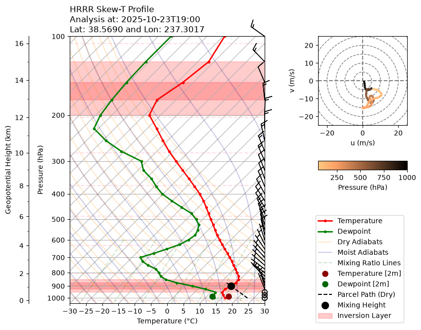

# HRRRSkewT

Are you interested in atmospheric vertical profiles, but find your self writing custom code every time? Or do you analyze prescribed burn data and feel that the typical vertical profile plot do not include the diagnostic variables that you care about?

HRRRSkewT is a Python CLI tool designed to download NOAA High-Resolution Rapid Refresh (HRRR) weather forecast data for specific coordinate points and generate publication-quality Skew-T Log-P / Hodograph diagrams using MetPy, with a particular focus on variables relevant to prescribed fire (Rx fire) planning.

## Features

- **Point Location Downloads**: Easily pull HRRR isobaric profile data and near-surface variables for a specific coordinate point and date range.
- **Skew-T & Hodograph Plots**: Render combined Skew-T Log-P profiles and wind hodographs in a single figure.
- **Inversion Layer Detection**: Calculate and report atmospheric temperature inversion layers, highlighting them visually on the Skew-T chart.
- **Mixing Height Calculation**: Automatically compute the mixing height using the parcel method (dry adiabat intersection from surface temperature offset) and annotate the parcel path and mixing level.
- **Dynamic File Naming**: Saved datasets and figures automatically include coordinate coordinates and valid times in their names.

## Example Skew-T plot



## Installation

Ensure you have a Python environment (Python 3.10+ recommended) active. Clone the repository and install it in editable mode:

```bash
git clone https://github.com/danineamati/HRRRSkewT.git
cd HRRRSkewT
pip install -e .
```

*Note: The CLI dependencies include `herbie-data[extras]`, `metpy`, `xarray`, `matplotlib`, and `tyro`.*

## CLI Usage

Run the main CLI script using the `hrrrskewt` executable:

```bash
hrrrskewt --help
```

We purposely split the CLI into a download and a plotting module because you may frequently tweak the plotting without wanting to re-download the data (or even re-check the download logic) every time.

### 1. Download HRRR Data

Download meteorological datasets for a specific coordinate location:

```bash
hrrrskewt download --latitude <float> --longitude <float> --start-time <YYYY-MM-DDTHH:MM> [options]
```

**Options**:

- `--latitude`: Target latitude (required).
- `--longitude`: Target longitude (required).
- `--start-time`: Start date/time of the sounding, e.g., `2025-10-24T00:00` (required).
- `--end-time`: End date/time (if downloading a range). Defaults to `start-time`.
- `--forecast-hour`: Forecast lead time in hours (default: `0` for Analysis/F00).
- `--interval-hours`: Interval between soundings in hours (default: `1`).
- `--save-dir`: Directory to save the NetCDF output (default: `./data_hrrr`).

**Example**:

```bash
hrrrskewt download --latitude 38.573363 --longitude -122.691302 --start-time 2025-10-24T00:00
```

*The downloaded point profile is saved as a NetCDF file, e.g., `./data_hrrr/hrrr_skewt_38p573_-122p691_20251024_0000.nc`.*

---

### 2. Plot Skew-T & Hodograph

Generate the Skew-T and Hodograph chart from a downloaded NetCDF dataset:

```bash
hrrrskewt plot --nc-file <path_to_nc_file> [options]
```

**Options**:

- `--nc-file`: Path to the NetCDF file containing point data (required).
- `--save-dir`: Directory where the generated plot image will be saved (default: `./skewt_spot`).
- `--rx-fire` / `--no-rx-fire`: Whether to calculate and draw mixing height, parcel trajectory, and inversion layer annotations (default: `--rx-fire`).

**Example**:

```bash
hrrrskewt plot --nc-file ./data_hrrr/hrrr_skewt_38p573_-122p691_20251024_0000.nc
```

*The generated plot is saved as a PNG image in `./skewt_spot/`.*
